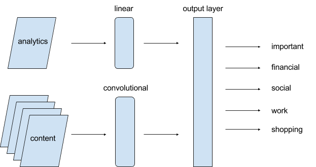

# GraphQL Machine Learning Server
Welcome to the open-source, Zimbra Machine Learning server for text and email classification. This server provides a solution for basic text classification requirements, including subject, sentiment, author, and social toxicity/obscenity, or an unlimited number of other classifications. All of this capability from defining a classifier to loading or creating a new vocabulary, training the classifier, and classifying content can be accessed through the GraphQL API or directly through the libraries.

In the current version, classification is performed using a neural network designed by the server's original author, https://github.com/miketout, and described below. The neural network is a multi-input convolutional graph without pooling that is the same for all types of tasks.

Using this general design, the Zimbra ML server can provide an easy to use API that offers competitive and acceptable classification results for many applications. While the neural networks currently perform competitively or better across a general set of tests than common LSTM or other convolutional architectures, there will always be room for improvement on these kinds of tasks as well as in pre-trained word vectors. As an open source project, we encourage data scientists or software developers interested in and capable of improving this classification server to fork the project and contact us about pull requests.

# Automatic Text Classification

As part of the Next Gen Zimbra server, we have implemented an automatic message text classification system, initially supporting email,  HTML and text, which will, by default, tag incoming messages with classification categories based on [insights published on automatic classification](https://arxiv.org/pdf/1606.09296.pdf) by Yahoo Research.

The core insight from recent research such as Yahoo’s that we will leverage to provide default benefit from the classifier is that a small number of automatic categories can provide significant value to users and maps to the most common way people who take the time already organize their folders. While Yahoo used latent dirichlet allocation (LDA), topic modeling, opt-in user interaction, and a great deal of analytics, we took a simpler approach that leverages the value of their conclusions, while using word embedding techniques and convolutional neural networks to provide simple text classification that is competitive with other general state of the art methods.

As a starting point, we have built a general classification server, and focused our efforts and design on the requirement that the system do an acceptable or better job classifying messages, at least in the general categories considered most useful.

The broad categories yahoo identified as useful and important in Yahoo’s research were: "human" generated, “shopping”, “financial”, “travel”, “social”, and “career”. While separating out “human” as a category simplified classification using bag of words methods or cosine similarity and allowed for some shortcuts (all “re:” and “fw:” mails were considered human), it would certainly help if an email system could separate human generated messages into those that are more likely to be considered important as well as allow human generated messages to be included in the category “career” or “financial”, as well as potentially any of the others.

# Zimbra Message Classifier

In order to improve upon today’s best approaches, make these categories fit the broadest number of users, regardless of their profession or lifestyle, and attempt to provide more organization of all e-mail streams, not just computer generated, we define the following categories:

* "Important" - all mails that the system believes the user is likely to consider higher priority or more important than the others. While messages categorized into important will usually be human generated, we may also find that certain types of computer generated mail, such as bank notifications, utilities, bills, permits, or other types of mail is generally considered important/high priority for users.

* "Work" - this is intended to serve as a proxy for “career”, since while not everyone will identify with having a career specifically, almost all people, whether entrepreneurs, house husbands/wives, career minded professionals, or CEOs likely have work.

* "Shopping" - the promotional spam that you don’t consider spam

* "Financial" - this likely includes mail from financial institutions/banks, etc., but may include human generated email from a stock broker, etc.

* "Social" - notifications and messages from social networking services

In addition to processing the message subject and text, we also leverage the following data in making our classification decision:

* address headers, complete email/friendly addresses, to and cc blocks

* subject and hash of canonical subject

* body text

# Analytics for Scalable Personalization

To enable the use of a machine learning model that is common to all users, yet makes decisions based on individual users’ relationships to senders, text/subject and other addresses in the mail address block, certain features used for classification of messages are based on analytics, which are processed and gathered regularly for each account. The following are analytics-based features that we include when classifying emails as "important".

Analytics or metadata-driven Features

1. How many times has user sent e-mail to sender?

2. How many times has sender sent e-mail to user?

3. 1 & 2 for past day, week, month, forever

4. Abbreviate #3 for first 10 addresses in to/cc

5. Percent email opened from sender, avg time to open email from sender vs. global avg

6. Subject canonical hash matches sent mail at any time from user to sender (this may be difficult or require contact analytics of canonical subject hashes to user)

7. User is on "to", “cc”, “none/bcc”

8. Number of other users on "to" on “cc”

9. Subject canonical hash matches recently sent mail

While the convolutional networks employed do an excellent job of classifying a given amount of text, features are generally rolled up to a paragraph level. We have found that with a simplifying assumption that all of the text required to properly classify the overwhelming majority of e-mail will be contained in the first 60 words of an e-mail’s concatenated subject and body text, we can get almost the same results for our purposes as if we consider the entire text. The rationale for this approach is that anyone sending e-mail that they expect the receiver to read, except for cases where the identity of the sender overwhelmingly takes precedence over the subject, MUST identify their topic very early in the message.

Since we expect to attempt classification on a broad range of emails, including those generated by humans, we must be able to understand an incredibly large vocabulary, while remaining localizable to multiple languages. We use a convolutional network that employs multi-field scanning techniques rather than rely on TF-IDF or bag of words models for classification, and to deal with the inherently large vocabulary space while still enabling generalized learning of our classifiers, we employ word embeddings, providing options for using pre-trained word embeddings, or generating word embeddings specifically for the training task at hand. For example, it is widely cited in word embedding tutorials that in typical embeddings, if you take the vector representation of the word for "king", subtract the vector of the word for “man”, and add the vector of the word for “woman”, the resulting vector will be extremely close to the vector for “queen”. For some tasks, the use of pre-trained word embeddings can improve generalization across terms or combinations of terms that a classifier may not have previously encountered.

Additional features, such as analytics results will be combined with the convolutional network’s results through a linear network, followed by classification output of categories that include exclusive tags "work", “financial”, “social”, “shopping”, and other tags that can overlap with any of them, such as “important”. The network structure is generally the following:

The current classifier allows selection and configuration of a wide variety of pre-trained, as well as custom vocabularies.

# Current Project Status, Installation, and Setup
The Zimbra Machine Learning Server is still a work in progress, but it is already quite capable. Example/test applications for training classifiers that are currently provided deliver competitive results on a variety of ML text classification benchmarks, including sentiment classification, author identification, and multi-class comment toxicity/threat/hate. In addition, the current Machine Learning Server, which enables the Zimbra Collaboration Server to deliver smart folder functionality also provides the foundation of an email and text data-mining capability that can extend far beyond smart folders.

Some text classification tasks perform better using pre-trained word vector vocabularies, of which both FastText and Glove vectors are supported. For example, the Twitter Sentiment test does best with Twitter trained glove vectors. The author identification challenge however, as it includes less common vocabulary, performs much better with a custom vocabulary, which the Zimbra ML server can automatically create.

While the code is prepared for subscriptions to support web-socket based training monitoring between mini-batches and epochs, the current GraphQL API does not yet publish this data from the ML callbacks. This is currently a todo item.

In order to install the Zimbra Machine learning server, you will need Python 3.4 or greater and must also install:
1. Fork of Intel's Nervana Neon [miketout's Neon fork](https://github.com/miketout/neon) that provides enhanced stability on CPUs and additional branching capabilities in its model graphs. The easiest way to install Nervana Neon is using virtualenv and Python 3.5+. It is also possible to use Miniconda, but to do so, you will need to update the main Miniconda Python libraries to include the source code of "ensurepip" after installation and before creating virtual environments. You will also need to install virtualenv using pip into the virtual environment that you create with miniconda. It sounds complicated, but I personally find it a great way to use more recent Python versions.
2. TornadoQL [miketout's TornadoQL fork](https://github.com/miketout/tornadoql), providing graphene and Tornado Web Server integration for serving graphQL APIs.
3. BeautifulSoup (pip install bs4)

Clone the main zimbra-ml project into a directory. In that directory, add a "data" directory, where you will create additional subdirectories "meta", "models", "vocabularies", and "train". You may prepopulate the vocabularies sub-directory with glove or fasttext vocabulary files, which can be specified in the examples from the command line parameters.

Ensure that you are in a virtual environment with the requirements installed, in the zimbra-ml working directory and run "python server.py". This will load and run the Zimbra machine learning server on port 8888 of the current machine. In a browser, go to http://localhost/graphiql to view and interact with the machine learning API.
